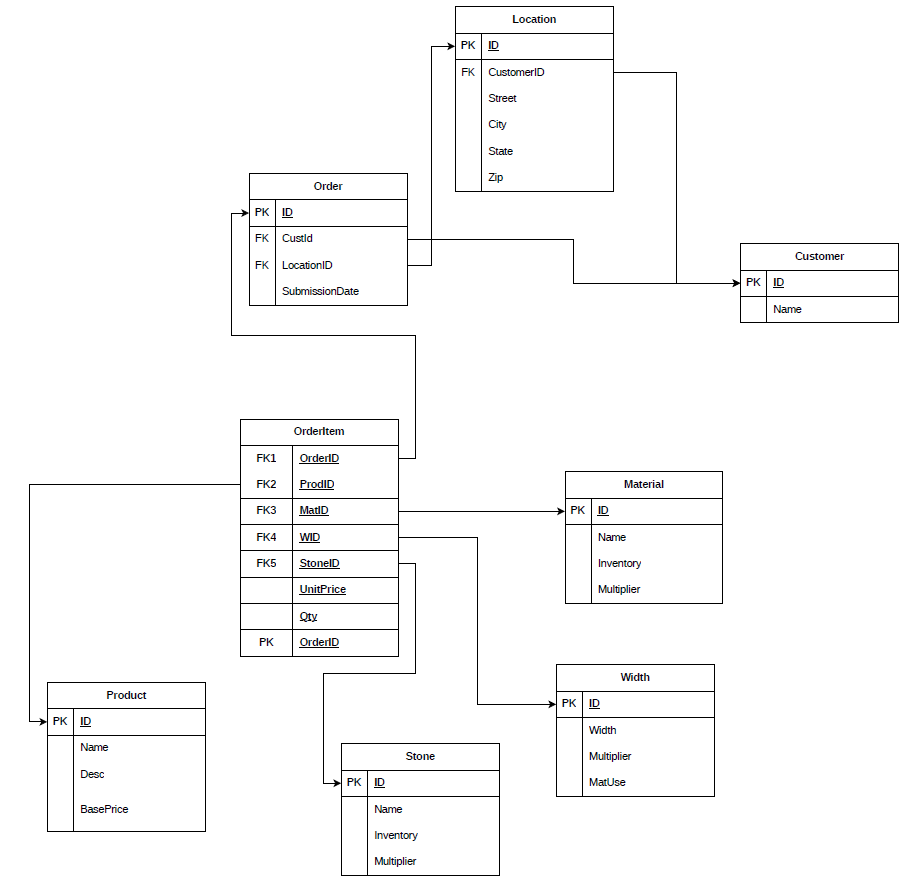

---
description:
---
# Database Schema

## Overview

<!-- Provide a high-level overview of the database architecture and its role in the system -->

## Entity-Relationship Diagram

## Database Objects & Schema

### Tables

#### Order
<!-- Define table structure, columns, data types, constraints -->

#### OrderItem
<!-- Define table structure, columns, data types, constraints -->

#### Customer
<!-- Define table structure, columns, data types, constraints -->

#### Location
<!-- Define table structure, columns, data types, constraints -->

#### Product
<!-- Define table structure, columns, data types, constraints -->

#### Material
<!-- Define table structure, columns, data types, constraints -->

#### Stone
<!-- Define table structure, columns, data types, constraints -->

#### Width
<!-- Define table structure, columns, data types, constraints -->

### Relationships

<!-- Document primary key and foreign key relationships between tables -->

## Data Requirements

### Data Dictionary

<!-- Define each table and column with descriptions and data types -->
